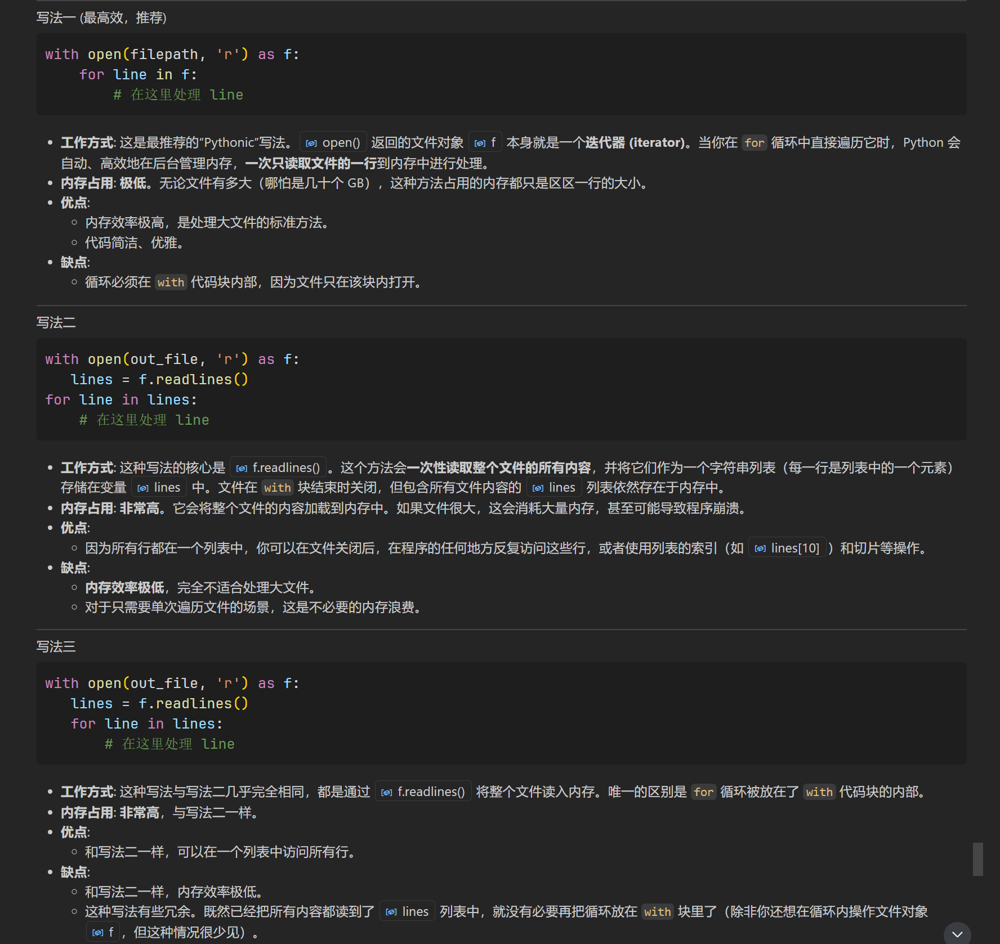

# 某些代码片段的记录
1.  
    ```python
    if all(k in data for k in ['e1', 'e2','e3', 'e7', 'e8', 'e9']):
    语句解析
    ```
    
2. 
    ```python
    with open(filepath, 'r') as f:
        for line in f:

    with open (out_file, 'r') as f:
        lines = f.readlines()
    for line in lines:
        
    with open (out_file, 'r') as f:
        lines = f.readlines()
        for line in lines:
    三种写法的差异
    ```
	
# python标准库
## Pathlib
1. `Path(__file__).parent`和`Path('.')`
	1. `Path('.')` 指的是**当前工作目录**
	2. `Path(__file__).parent` 指的是**脚本文件所在的目录**。

# pandas:
1. `.pivot()`,数据透视。重新设置数据的行列。(https://blog.csdn.net/superY_26/article/details/112689493)